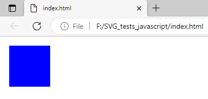

### simple examples with SVG files

### first step to install nodejs packages or to install dependencies
npm init 
npm install inquirer
npm install child_process
npm install xmlserializer jsdom d3 fs open

npm install
### all examples 
__index.js__ - all examples

__index_001.js__ - create a SVG source code , add to a HTML source code and show this in the browser window 

__index_002.js__ - test file for testing inquirer 

__index_003.js__ - test file for testing inquirer 